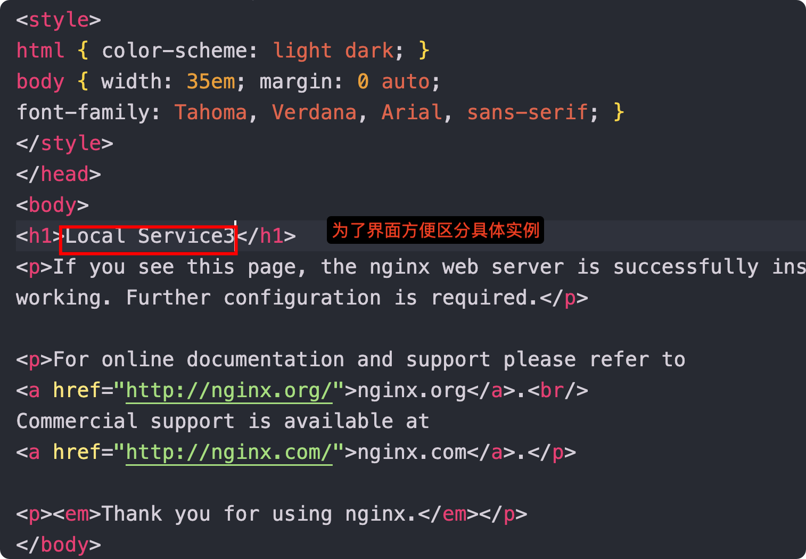

# http_proxy
## 一、功能说明
提供如下功能：
1. http请求轮询转发到后端机器
2. 后端机器列表动态更新(增加、删除)
3. healthcheck
4. 支持多域名http转发

## 二、使用
### 2.1 启动
启动http_proxy服务，默认端口：8080

### 2.2 配置
#### 2.2.1.增加域名对应服务名配置
POST http://localhost:8080/mgt/domain/update

body参数如下：
```
{
    "data":[
        {
            "domain": "www.a.com",
            "serviceName": "nginx-service"
        }
    ]
}
```
* 上面配置了访问www.a.com时，会自动解析nginx-service服务名下的真实服务
* 需确保本地www.a.com能访问将请求转发到localhost:8080端口上
* 如不能但又不想配置域名解析，请配置domain为 localhost:8080 ,仅供测试用
#### 2.2.2.查看域名对应服务名配置列表
GET http://localhost:8080/mgt/domain/list
返回结果如下
```
{
    "www.a.com": "nginx-service",
    "localhost:8080": "nginx-service"
}
```

#### 2.2.3.增加服务对应地址配置
POST http://localhost:8080/mgt/service/update

body参数格式如下：
```
{
    "serviceName": "nginx-service",
    "action": 1,
    "address": [
        "192.168.1.2:9000",
        "192.168.1.2:9001",
        "192.168.1.2:9002"
    ]
}
```
body参数说明：
* serviceName: 域名映射中的服务名
* action: 操作类型
  * 1 : 添加
  * 0 : 删除
* address: 要添加的真实服务列表

注意：
* 此处的192.168.1.2:xxx为需要用到的服务地址

#### 2.2.4.查看已配置服务列表
GET http://localhost:8080/mgt/service/list

响应如下：
```
{
    "nginx-service": {
        "Name": "nginx-service",
        "Items": {
            "192.168.1.2:9000": "2023-12-24T20:19:59.321658+08:00",
            "192.168.1.2:9001": "2023-12-24T20:19:59.321659+08:00",
            "192.168.1.2:9002": "2023-12-24T20:19:59.321659+08:00"
        }
    }
}
```

## 三、演示
### 3.1 依赖
为了演示上面效果，在此启动了3个nginx服务，其IP如下：

* 192.168.1.2:9000 ： local service1
* 192.168.1.2:9001 ： local service2
* 192.168.1.2:9002 ： local service3

并且分别编辑其默认index.html，如图：


### 3.2 演示轮询
调用上面配置的域名：www.a.com, 请求多次，会看到页面返回不同信息。如
第一次：


第二次


第三次

交替显示...

### 3.2 演示health check
1. 停掉一台nginx 3服务(local service3)
2. 重新多次请求3.2中地址
3. 会发现只有1和2，不会再有3

### 3.3 动态更新
目前健康检测周期为5秒。

1. 启动3.2中的nginx 3服务
2. 调用服务更新接口，增加nginx3地址信息
```
POST http://localhost:8080/mgt/service/update

body:
{
    "serviceName": "nginx-service",
    "action": 1,
    "address": [
        "192.168.1.2:9002"
    ]
}
```
3. 重新按3.2中那样请求，会发现local service3重新出现

## 四、代码说明
1. config：
   * 管理域名与服务的配置关系
   * 管理服务和具体实例的配置关系
2. loadbalance：
   * 只实现了个简单的轮询功能
3. health: 健康检测
4. model: 管理功能所需参数定义

